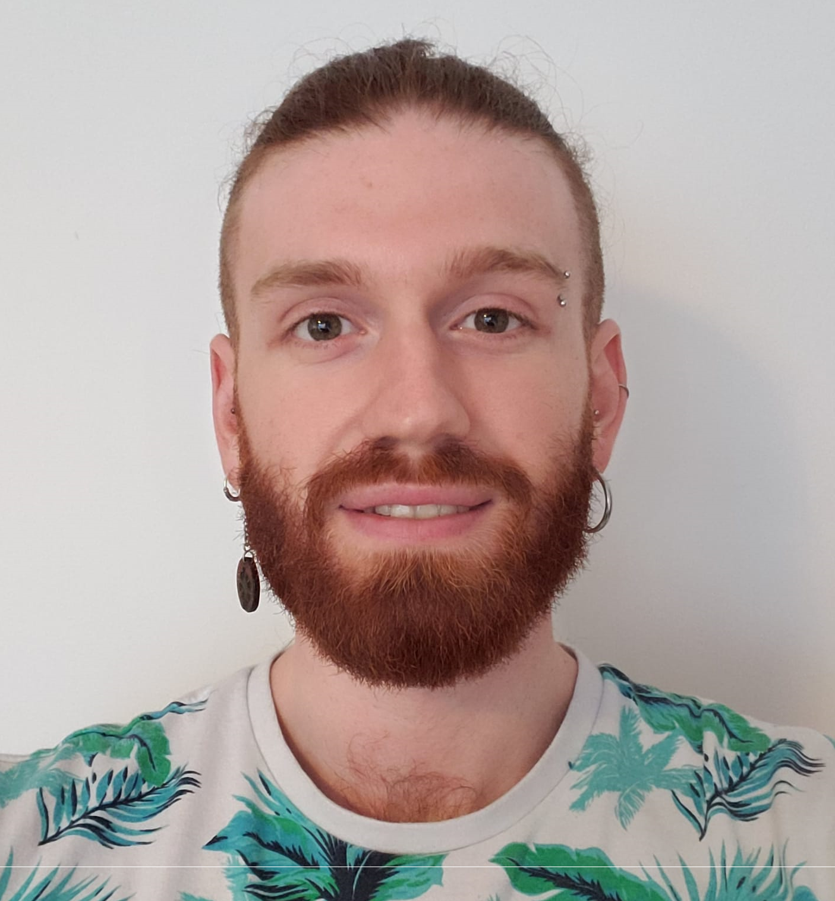

{fig-align="center" width="293"}

::: {.d-flex .justify-content-center .gap-3 .flex-wrap}
<!-- Google Scholar -->

<a class="btn btn-outline-primary rounded-circle p-3"
     href="https://scholar.google.com/citations?hl=en&user=fteDslYAAAAJ&view_op=list_works&sortby=pubdate"
     target="_blank"
     title="Google Scholar"> <i class="bi bi-mortarboard-fill" style="font-size:1.5rem;"></i> </a>

<!-- LinkedIn -->

<a class="btn btn-outline-primary rounded-circle p-3"
     href="https://www.linkedin.com/in/benjamin-valderrama-794664195/"
     target="_blank"
     title="LinkedIn"> <i class="bi bi-linkedin" style="font-size:1.5rem;"></i> </a>

<!-- Bluesky (custom SVG icon) -->

<a class="btn btn-outline-primary rounded-circle p-3"
     href="https://bsky.app/profile/bvalderrama.bsky.social"
     target="_blank"
     title="Bluesky">  <path d="m135.72 44.03c66.496 49.921 138.02 151.14 164.28 205.46 26.262-54.316 97.782-155.54 164.28-205.46 47.98-36.021 125.72-63.892 125.72 24.795 0 17.712-10.155 148.79-16.111 170.07-20.703 73.984-96.144 92.854-163.25 81.433 117.3 19.964 147.14 86.092 82.697 152.22-122.39 125.59-175.91-31.511-189.63-71.766-2.514-7.3797-3.6904-10.832-3.7077-7.8964-0.0174-2.9357-1.1937 0.51669-3.7077 7.8964-13.714 40.255-67.233 197.36-189.63 71.766-64.444-66.128-34.605-132.26 82.697-152.22-67.108 11.421-142.55-7.4491-163.25-81.433-5.9562-21.282-16.111-152.36-16.111-170.07 0-88.687 77.742-60.816 125.72-24.795z" /> </svg> </a>

<!-- CV Download -->

<a class="btn btn-outline-primary rounded-circle p-3"
     href="files/bv_CV2025.pdf"
     download
     title="Download Full CV"> <i class="bi bi-file-earmark-text-fill" style="font-size:1.5rem;"></i> </a>

<!-- GitHub -->

<a class="btn btn-outline-dark rounded-circle p-3"
     href="https://github.com/Benjamin-Valderrama"
     target="_blank"
     title="GitHub"> <i class="bi bi-github" style="font-size:1.5rem;"></i> </a>
:::

# Short Bio

I'm a [Computational Biologist]{.my_bold} :computer::dna: with seven years of research experience distilling key biological insight from large and complex multidimensional datasets. I've held positions in Academia, Industry and their interface. I've also worked as a consultant and analyst for academic research groups.

I'm currently doing my PhD, where I focus on the balanced integration of global-scale datasets with biologically-grounded analytical approaches to unravel the complexity of the [microbiome-gut-brain axis]{.my_bold}. My work is supervised by Professors John F. Cryan and Gerard Clarke at the APC microbiome Ireland.

In my daily life I like reading books (mostly non-fiction), hiking, drinking coffee and doing 3D design and printing.

# Areas of research

::: bullet-list
-   Large-scale analyses of the microbiome-gut-brain axis across global populations.
-   Microbiome's modulation of gut barrier integrity and its effects on gut-brain health.
-   Development of Probiotics and Psychobiotics.
:::
