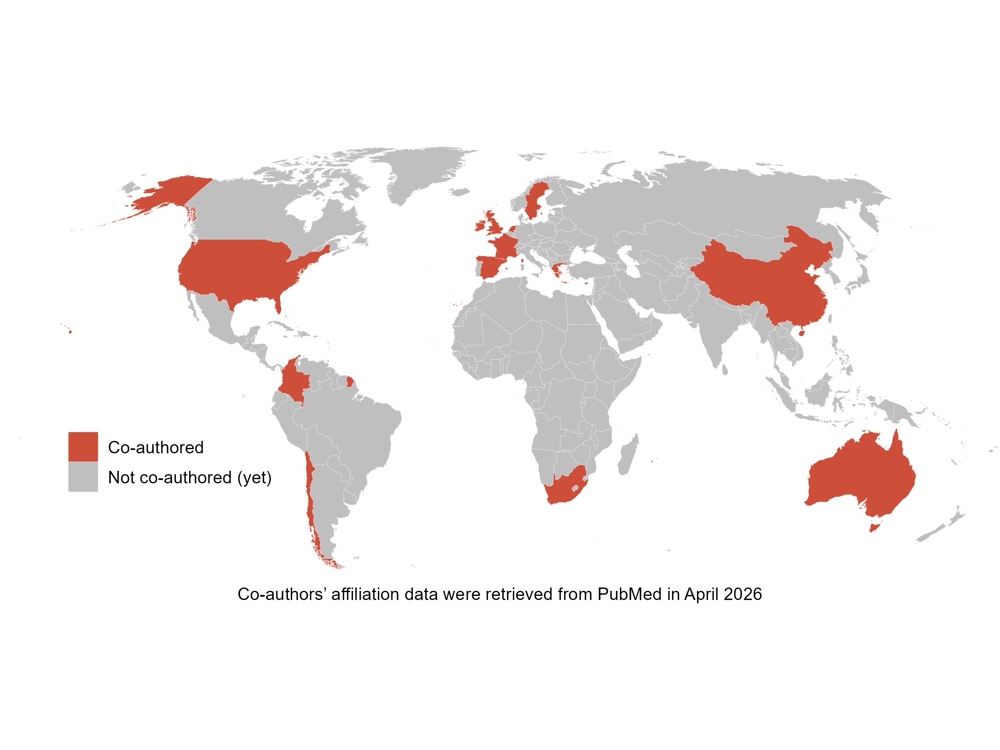

 

# Complete list of publications

A full list of all my publications can be found at [Google Scholar](https://scholar.google.com/citations?hl=en&user=fteDslYAAAAJ&view_op=list_works&sortby=pubdate) and [ORCID](https://orcid.org/0000-0002-4740-8965).

 

# Selected publications in key areas

### 1. Microbiome-Gut-Brain axis across global populations

::: bullet-list
-   [The South American MicroBiome Archive (saMBA): enriching the microbiome field by studying neglected populations](https://www.nature.com/articles/s41467-025-62601-4){.my_bold}, (2025), [Benjamin Valderrama]{.my_bold}, Paulina Calderon-Romero, Thomaz FS Bastiaanssen, Aonghus Lavelle, Gerard Clarke, John F Cryan, [Nature Communications]{.my_bold}.

-   [Global environmental change and the gut-kidney-brain axis: a review and framework of vulnerability and resilience](https://www.thelancet.com/journals/lanplh/article/PIIS2542-5196(26)00026-4/fulltext){.my_bold}, (2026), Shazia Adalat, Konstantinos Giannakou, [Benjamin Valderrama]{.my_bold}, Juan Guillermo Cardenas-Aguilera, Giorgos K Sakkas, Jonathan Overeem, Gaye Hafez, Dearbhla Kelly, Jelena Vulevic, Guohua He, Silvia M Mihaila, Alessandra Tammaro, Burcin Ikiz, Prof John F Cryan, [The Lancet Planetary Health]{.my_bold}

-   [The Neuroactive Potential of the Elderly Human Gut Microbiome is Associated with Mental Health Status](https://journals.plos.org/plosone/article?id=10.1371/journal.pone.0343493){.my_bold}, (2024), Paulina Calderon-Romero, [Benjamin Valderrama]{.my_bold}, Thomaz Bastiaanssen, Patricia Lillo, Daniela Thumala, Gerard Clarke, John F Cryan, Andrea Slachevsky, Christian Gonzalez-Billault, Felipe A. Court, [PLOS One]{.my_bold}.
:::

----

### 2. Probiotics and Psychobiotics

::: bullet-list
-   [In vitro assessment of bacterial supernatants on hypothalamic gene expression: implications for appetite regulation](https://www.nature.com/articles/s41522-025-00820-9){.my_bold}, (2025), Cristina Cuesta-Marti, [Benjamin Valderrama]{.my_bold}, Thomaz Bastiaanssen, John F Cryan, Catherine Stanton, Siobhain M O'Mahony, Gerard Clarke, Harriet Schellekens, [npj Biofilms and Microbiomes]{.my_bold}.

-   [From in silico screening to in vivo validation in zebrafish - a framework for reeling in the right psychobiotics](https://pubs.rsc.org/en/content/articlehtml/2025/fo/d4fo03932g){.my_bold}, (2024), [Benjamin Valderrama]{.my_bold}, Isabelle Daly, Eoin Gunnigle, Kenneth J. O'Riordan, Maciej Chichlowski, Sagarika Banerjee, Alicja A. Skowronski, Neeraj Pandey, John F. Cryan, Gerard Clarke, Jatin Nagpal, [Foods & Function]{.my_bold}.
:::

----

### 3. Microbiome data analysis

::: bullet-list
-   [Orchestrating Microbiome Analysis with Bioconductor](https://www.biorxiv.org/content/10.1101/2025.10.29.685036v1.full){.my_bold}, (2025), Tuomas Borman, Giulio Benedetti, Geraldson Muluh, Aura Raulo, [Benjamin Valderrama]{.my_bold}, Artur Sannikov, Stefanie Peschel, Yihan Liu, Rasmus Hindstrom, OMA consortium, Katariina Parnanen, Christian L. Muller, Aki S. Havulinna, Sudarshan Shetty, Marcel Ramos, Domenick J. Braccia, Hector Corrada Bravo, Felix M. Ernst, Levi Waldron, Thomaz F. S. Bastiaanssen, Himel Mallick, Leo Lahti. [Under review at Nature Biotechnology]{.my_bold}.

-   [Chapter 26 : Machine Learning](https://microbiome.github.io/OMA/docs/devel/pages/machine_learning.html) - [Orchestrating Microbiome Analysis (OMA) book]{.my_bold}, (2025), [Benjamin Valderrama]{.my_bold}. The review of the chapter is open to anyone, and can be accessed [here](https://github.com/microbiome/OMA/commit/64262b2170b6207e7f528eeef7054d036d31a6c2).
:::

 

# My Global Co-authorship Map

If you are interested in collaborating, you can contact me at: contact@bvalderrama.com

{fig-align="center" width="700"}
