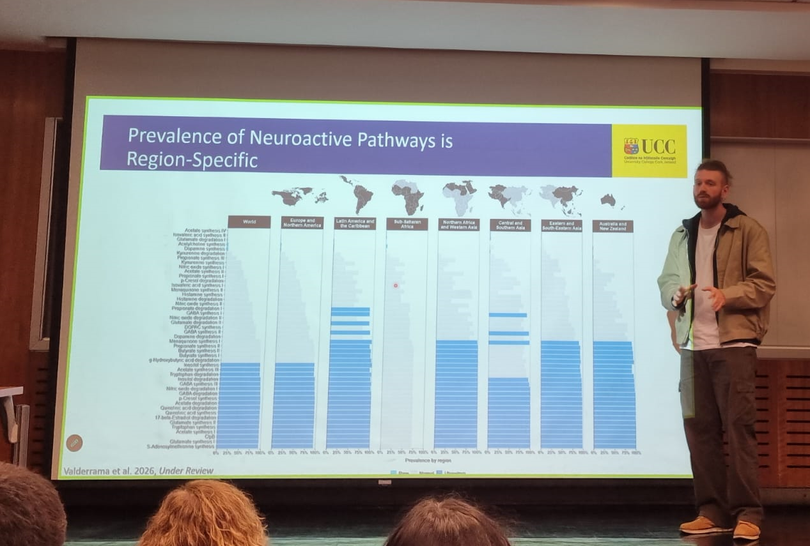

<!-- comment{fig-align="center" width="500"} -->

::: bullet-list
- [Mapping the microbiome–gut–brain axis across global population]{.my_bold}, Presented at the Microbiome Journal Club of the National Cancer Institute (NIH), US. (Remote). 17th of June, 2026.

- [Mapping the microbiome–gut–brain axis across global population]{.my_bold}, Inveted Seminar at School of Biological Sciences at Universidad Católica, Chile. 03rd of July, 2026.
:::